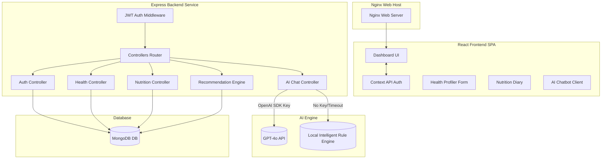

# System Architecture & Technical Specifications

This document outlines the technical design, architectural patterns, and structural modules of the AI-Powered Personalized Healthcare and Nutritional Recommendation system.

---

## 1. Technical Stack
- **Frontend SPA**: React.js, Tailwind CSS, Lucide Icons, Axios.
- **Backend API**: Node.js, Express, Mongoose ODM.
- **Database**: MongoDB.
- **DevOps**: Docker, Nginx, Jenkins CI/CD.

---

## 2. Architecture Diagram



---

## 3. Database Schema Blueprint (MongoDB via Mongoose)

### 3.1 `User` Document
Stores authentication metadata.
```json
{
  "_id": "ObjectId",
  "name": "String",
  "email": "String (Unique, Lowcase)",
  "password": "String (Bcrypt Hashed)",
  "createdAt": "Date"
}
```

### 3.2 `HealthProfile` Document
Maintains user vital statistics, clinical identifiers, and calculated BMI.
```json
{
  "_id": "ObjectId",
  "user": "ObjectId (Ref User, Unique)",
  "age": "Number",
  "gender": "String ('Male' | 'Female' | 'Other')",
  "weight": "Number (kg)",
  "height": "Number (cm)",
  "deficiencies": "Array [String]",
  "diseases": "Array [String]",
  "fitnessGoals": "String ('Weight Loss' | 'Weight Gain' | 'Muscle Building' | 'Healthy Balanced Diet' | 'Manage Vitals')",
  "bmi": "Number (Pre-calculated: weight / height_meters^2)",
  "updatedAt": "Date"
}
```

### 3.3 `FoodItem` Document
Stores food macro and micro-nutrients per 100g.
```json
{
  "_id": "ObjectId",
  "name": "String (Unique)",
  "category": "String ('Grains & Cereals' | 'Dairy Products' | 'Lentils & Pulses' | ...)",
  "calories": "Number (kcal)",
  "protein": "Number (g)",
  "carbohydrates": "Number (g)",
  "fat": "Number (g)",
  "vitamins": "Array [String] (e.g. ['A', 'D', 'B12'])",
  "minerals": "Array [String] (e.g. ['Calcium', 'Iron'])",
  "recommendedForDeficiencies": "Array [String]",
  "avoidForDiseases": "Array [String]",
  "goodForDiseases": "Array [String]",
  "isIndianDiet": "Boolean (Default: true)"
}
```

---

## 4. Architectural Rules & Algorithmic Engines

### 4.1 Automated BMI Calculation
Executed in a database pre-save validation trigger in `HealthProfile.js`:
$$\text{BMI} = \frac{\text{weight (kg)}}{(\text{height (m)})^2}$$

### 4.2 Calorie Target Computation
Calculated via the **Harris-Benedict Equation** inside `recommendationController.js`:
- **Male**: $\text{BMR} = 88.362 + (13.397 \times \text{weight}) + (4.799 \times \text{height}) - (5.677 \times \text{age})$
- **Female**: $\text{BMR} = 447.593 + (9.247 \times \text{weight}) + (3.098 \times \text{height}) - (4.330 \times \text{age})$
- Adjusted daily target is computed using an activity multiplier ($1.375$) adjusted for user goals (deficit of $500$ for Weight Loss, surplus of $500$ for Weight Gain).

### 4.3 Recommendation & Avoid Filter
Queries the `FoodItem` collection where:
- *Recommended*: Food recommended for user's selected deficiencies OR good for user's chronic conditions.
- *Avoided*: Food that must be avoided for user's selected conditions.
- *Safety Filter*: Any overlap between Recommended and Avoided lists is dynamically filtered out to protect user safety (Avoid overrides Recommended).

### 4.4 AI Fallback Architecture
The `aiController.js` utilizes an automatic environment validation:
1. Validates `process.env.OPENAI_API_KEY`.
2. If verified, executes a tailored GPT-4 session with a comprehensive clinical dietician prompt specifying user vitals and meal choices.
3. If absent or in case of API timeout/limits, triggers the local smart recommendation engine which parses keywords in user queries (e.g. "protein", "diabetes", "calcium") and yields high-fidelity clinical and dietary guidance mapped directly to the user's active health profile.
